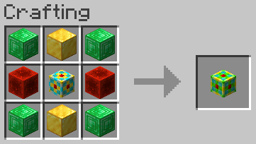

# 16k Storage Cell

## Texture

## Recipe

### Ingredients

### Pattern

### Materials
| Name | Quantity |
| ---- | -------- |
| Emerald Block | 4 |
| Gold Block | 2 |
| Redstone Block | 2 |
| 4k Storage Cell | 1 |

**Total Raw Materials:**

| Name | Quantity |
| ---- | -------- |
| Iron Ingot | 36 |
| Gold Ingot | 60 |
| Diamond | 4 |
| Redstone Dust | 23 |
| Quartz | 8 |
| Emerald | 36 |

## Information
Stores 16,384 bytes, which is equivalent 256 full stacks of items, or about 4.7 double chests

