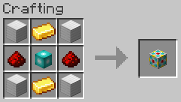

# 1k Storage Cell

## Texture

## Recipe

### Ingredients

### Pattern

### Materials
| Name | Quantity |
| ---- | -------- |
| Iron Block | 4 |
| Gold Ingot | 2 |
| Redstone Dust | 2 |
| [Storage Core](storage_core.md) | 1 |

**Total Raw Materials:**

| Name | Quantity |
| ---- | -------- |
| Iron Ingot | 36 |
| Gold Ingot | 6 |
| Diamond | 2 |
| Redstone Dust | 3 |
| Quartz | 8 |

## Information
Stores 1,024 bytes, which is equivalent 16 full stacks of items, or about 0.3 double chests

