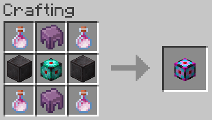

# 256k Storage Cell

## Texture

## Recipe

### Ingredients

### Pattern

### Materials
| Name | Quantity |
| ---- | -------- |
| Dragon's Breath | 4 |
| Shulker Shell | 2 |
| Netherite Block | 2 |
| 64k Storage Cell | 1 |

**Total Raw Materials:**

| Name | Quantity |
| ---- | -------- |
| Iron Ingot | 36 |
| Gold Ingot | 60 |
| Diamond | 22 |
| Redstone Dust | 23 |
| Quartz | 8 |
| Emerald | 36 |
| Eye of Ender | 2 |
| Netherite Ingot | 20 |
| Dragon's Breath | 4 |
| Shulker Shell | 2 |

## Information
Stores 262,144 bytes, which is equivalent 4,096 full stacks of items, or about 75.8 double chests

