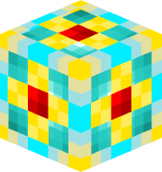
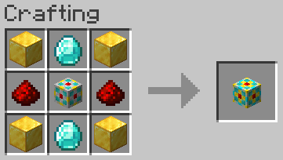

# 4k Storage Cell

## Texture

## Recipe

### Ingredients

### Pattern

### Materials
| Name | Quantity |
| ---- | -------- |
| Gold Block | 4 |
| Diamond | 2 |
| Redstone Dust | 2 |
| [1k Storage Cell](1k_storage_cell.md) | 1 |

**Total Raw Materials:**

| Name | Quantity |
| ---- | -------- |
| Iron Ingot | 36 |
| Gold Ingot | 42 |
| Diamond | 4 |
| Redstone Dust | 5 |
| Quartz | 8 |

## Information
Stores 4,096 bytes, which is equivalent 64 full stacks of items, or about 1.2 double chests

