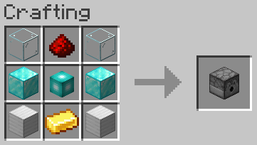

# Storage Controller

## Texture

## Recipe

### Ingredients

### Pattern

### Materials
| Name | Quantity |
| ---- | -------- |
| Glass | 2 |
| Diamond Block | 2 |
| Iron Block | 2 |
| Redstone | 1 |
| Gold Ingot | 1 |
| Storage Core | 1 |

**Total Raw Materials:**

| Name | Quantity |
| ---- | -------- |
| Glass | 2 |
| Diamond | 20 |
| Iron Block | 2 |
| Redstone | 2 |
| Gold Ingot | 5 |
| Quartz Block | 2 |

## Information
Loads storage cells and allows them to be accessed from the [Storage Terminal](storage_terminal.md)

