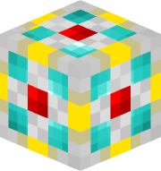
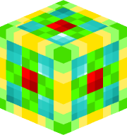
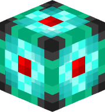
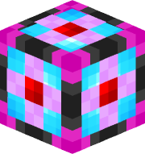
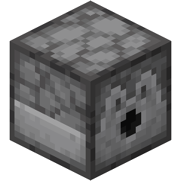
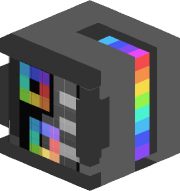

# Items
Currently, this plugin is extremely simple

There are 5 different types of storage cells
| Name | Texture |
| ---- | ------- |
| [1k Storage Cell](items/1k_storage_cell.md) | |
| [4k Storage Cell](items/4k_storage_cell.md) | |
| [16k Storage Cell](items/16k_storage_cell.md) | |
| [64k Storage Cell](items/64k_storage_cell.md) | |
| [256k Storage Cell](items/256k_storage_cell.md) | |

Unlike in AE2, each of these can store an unlimited number of item types.

A single stack of items takes up 64 bytes regardless of whether that item's max stack size is 64, 16, or 1.

There are also a few supporting items that enable you to use the storage cells

| Name | Texture |
| ---- | ------- |
| [Storage Core](items/storage_core.md) | |
| [Storage Controller](items/storage_controller.md) | |
| [Storage Terminal](items/storage_terminal.md) | |

Much like in AE2, the previous storage cell is required to craft the next bigger size. The first 1k storage cell is crafted using the storage core.

When an already used cell is put in the crafting grid to upgrade to the next size, the items are transferred over to the new cell.

The storage controller is like the disk drive in AE2, except it only holds one cell a time.

The storage terminal is used to access the cell's contents once it is loaded into the controller.

# Features
- The storage system is automatically sorted alphabetically
- You can search for items by material name (currently by custom item name)

# Planned Features
- Connecting the storage controller to hoppers
- QOL fixes related to the Storage Terminal GUI
- Utility commands to list cell UUIDs in the database and create a storage cell from them (for admins to restore lost storage cells)

# Technical Information
- On the backend, StorageSystem uses SQLite database to store items
- When first put into a controller, a storage cell is assigned a random UUID
- This UUID is stored in the database along with each item "in" the cell of that UUID